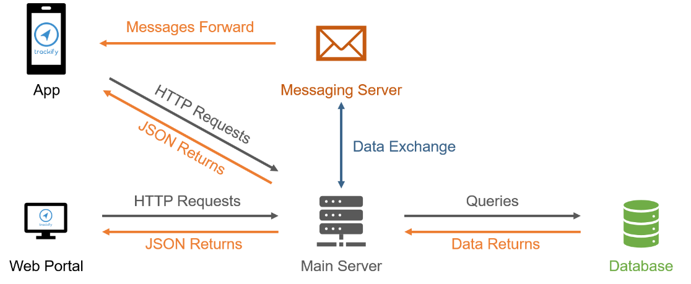

# Trackify Overview
This is an overview of Trackify - Dementia Patients Anti-Wandering System using Mobile Crowdsourcing, a CSE Final Year Project of HKUST in 2019-2020. 
## Project Information
#####  Topic Full Name
- Trackify - Dementia Patients Anti-Wandering System using Mobile Crowdsourcing
##### Project ID
- GCH2
#####  Supervisor
- Prof. Gary Shueng-Han CHAN
#####  Team Members
- CHONG Li Yen (https://github.com/lychongaa)
- FONG Lam Hang (https://github.com/lhfongaa)
- LEUNG Chun Hei (https://github.com/chleungao)
- PENG Zhixuan (https://github.com/PengZhixuan)

## Introduction
Hong Kong, similar to many cities in the world, is facing progressive population ageing that brings many challenges to our society. One of the generally recognized issues is the dementia, a brain disease commonly occurred in the aged group, hence the demand for anti-wandering of dementia people. There are some solutions like GPS tracking device to serve the purpose, though, they are not adequate to meet the need due to the following limitations:

1. Short service time,
2. High dependence on single data source, and
3. Costly and inconvenient maintenance.

Our project mainly develops a reliable dementia patients anti-wandering system, namely Trackify. It is a solution using a newly rising data sourcing model – mobile crowdsourcing to implement anti-wandering in which we outsource part of the localization task to our userbase. We build a fully functional system that involves a mobile app, a web portal, and a backend system with the use of iBeacon technology. Users can be served an anti-wandering service in approaches of higher capability to urban environments, more durable operations, and less inconvenience.

## Methodology

The idea of using mobile crowdsourcing is to outsource part of the work to our users, turning their mobile device to a medium of providing service and collecting data. How Trackify locates the patients and perform anti-wandering is relied on the computation of the data crowdsourced from their mobile devices.

The solution works based on the use of an iBeacon Tag. It is a portable device which continuously emits detectable beacon signals to the surroundings. To implement the anti-wandering, the patients have to take along with the tag. When their caregivers notify the system that their patients are lost, the app we provided to users can help detect the beacon signals from the lost patients and simultaneously upload their location data so that the system can locate the patient based on these data. Once the system successfully complete its computation, the resulting location will be displayed on the map in the app so that the caregivers can perform anti-wandering.

## System Architecture

## Development Tools
- Mobile App: Ionic Framework
- Web Portal: Ionic Framework
- Backend Server: Go Language
- Database: MongoDB

## Screenshots
- Coming soon!

## Installation
- Coming soon!

## Child Repository (Access Restricted)
### Frontend
- App: https://github.com/lhfongaa/trackify-app
- Web Portal: https://github.com/lhfongaa/trackify-webportal
  
### Backend
- https://github.com/lhfongaa/trackify-backend
